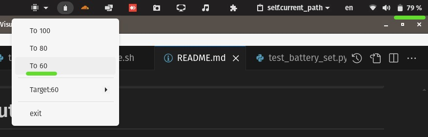

# About The Project



Have you ever wanted to limit your laptop battery charger to a certain percentage? Well now you can with this Battery Charge Controller.

Although there seems to be other alternatives such as [TLP](https://github.com/linrunner/TLP), this is a way more simpler project to use.

## Installation Guide

### Clone the project
Clone the project (or download it if you prefer)

This would clone the project in `Battery-Controller` under the current directory:
```bash
git clone https://github.com/i3130002/Battery-Controller.git
```

### Install requirements
Run the following in the cloned directory (You might replace the pip3 with pip if needed)

```bash
pip3 install -r requirements.txt
```

### Testing
Run the following to see if the application is working properly (On a successful run, you should see the application icon in the tray menu and be able to change the battery maximum charging percentage by providing the sudo password)

```bash 
python3 desktop.py
```

### Adding the application shortcut
To have a application shortcut in applications menu generate the following file (path: `~/.local/share/applications/battery-controller.desktop`)

**Make sure to replace the `{PROJECT_ABSOLUTE_PATH}` with the absolute cloned project directory path**

```
[Desktop Entry]
Name=Battery Charge Controller 
Version=1.0
Comment=A gui app Battery Controller for linux
Exec=python3 {PROJECT_ABSOLUTE_PATH}/desktop.py
Icon={PROJECT_ABSOLUTE_PATH}/assets/battery_not_charging.png
Terminal=false
Type=Application
```

## Issues
- As I am using `pkexec` to set the charging state, there might be issues if you don't have the right package installed.
 
## Tested On
* Asus TUF A15


## License
This software is for personal use only without the right to distribute or sell it.

THE SOFTWARE IS PROVIDED "AS IS", WITHOUT WARRANTY OF ANY KIND, EXPRESS OR
IMPLIED, INCLUDING BUT NOT LIMITED TO THE WARRANTIES OF MERCHANTABILITY,
FITNESS FOR A PARTICULAR PURPOSE AND NONINFRINGEMENT. IN NO EVENT SHALL THE
AUTHORS OR COPYRIGHT HOLDERS BE LIABLE FOR ANY CLAIM, DAMAGES OR OTHER
LIABILITY, WHETHER IN AN ACTION OF CONTRACT, TORT OR OTHERWISE, ARISING FROM,
OUT OF OR IN CONNECTION WITH THE SOFTWARE OR THE USE OR OTHER DEALINGS IN THE
SOFTWARE.

## Service (QT issues)

I wanted to have a service initially but I couldn't figure out how to do it without QT issues. The following is the service file for reference
Path: `sudo gedit /etc/systemd/system/batterycontrol.service`
```
[Unit]
Description=Battery Charge Controller
After=network.target
StartLimitIntervalSec=0
[Service]
Type=simple
Restart=no
RestartSec=10
User=user
ExecStart=python3 /home/user/Documents/Projects/Python/BatteryChargeLimitter/service.py

[Install]
WantedBy=multi-user.target
```

## Asset attribution
* [Ui icons created by Yudhi Restu - Flaticon](https://www.flaticon.com/free-icons/ui)
* [Power icons created by Freepik - Flaticon](https://www.flaticon.com/free-icons/power)